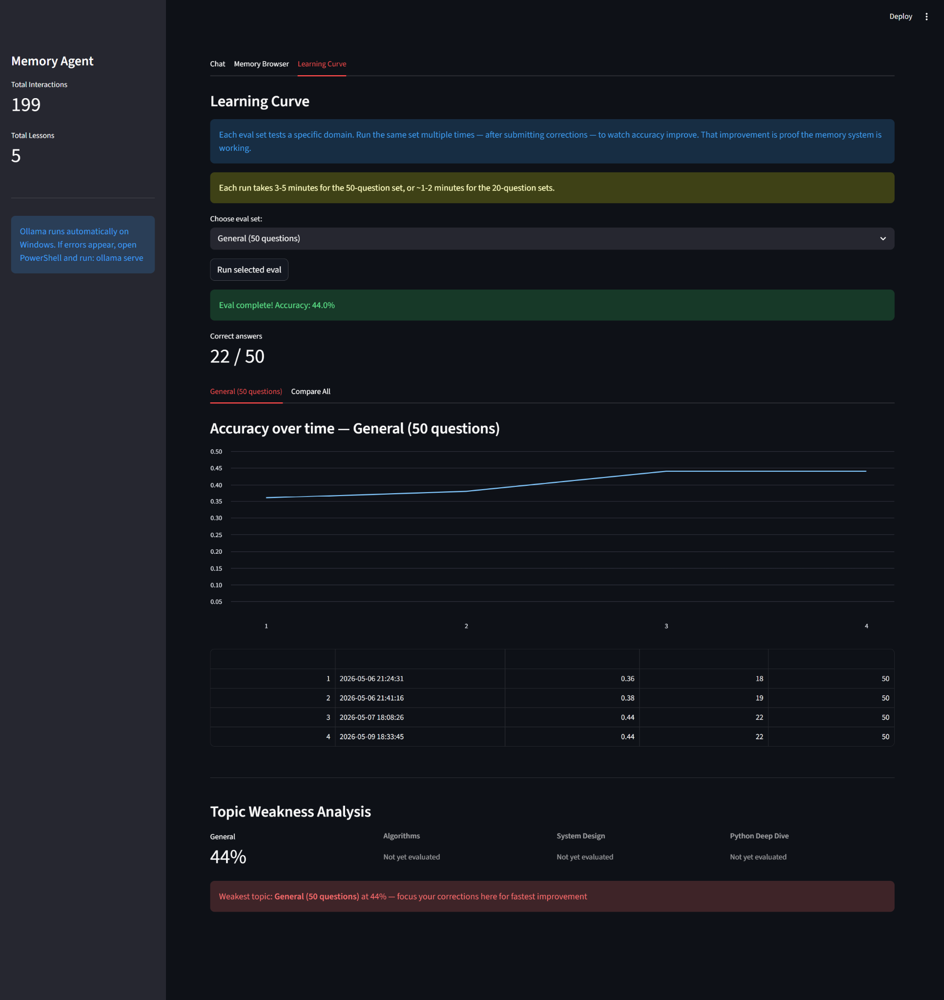
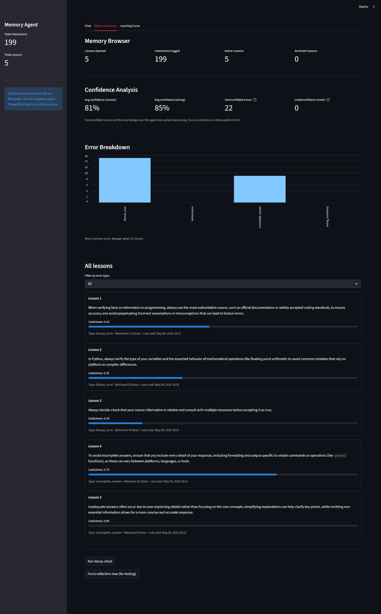
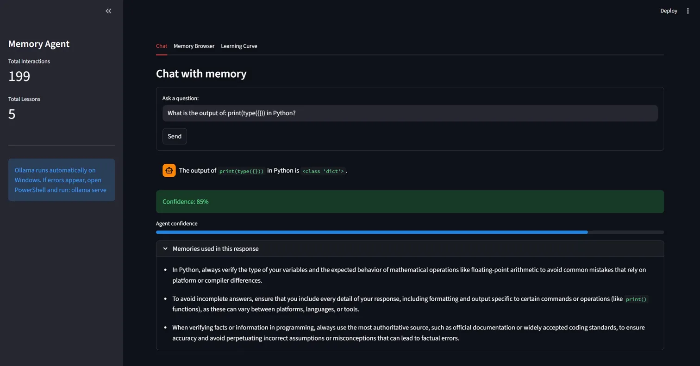
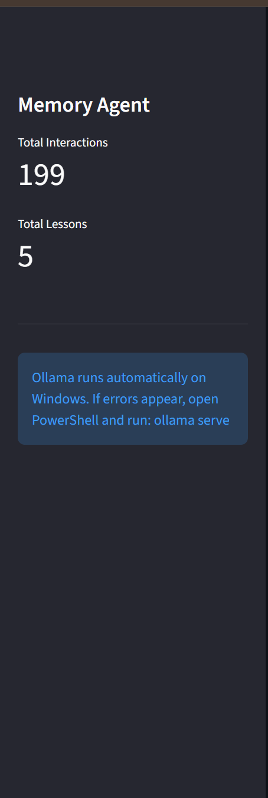

# MemoryLoop 🧠

> A self-improving AI agent that learns from its own mistakes
> using persistent vector memory and async reflection loops.
> Core agent runs locally with Ollama.
> Optional Gemini judge uses free-tier API key.


---

## What it does

MemoryLoop implements the Reflexion architecture, an LLM agent
that reflects on its own failures, distills lessons into persistent
vector memory, and retrieves those lessons at inference time to
improve future responses. Unlike standard LLMs that forget
everything between sessions, MemoryLoop accumulates knowledge
through a structured three-loop system. Accuracy is measured on a
fixed 50-question eval set, producing a quantifiable learning curve
that proves the memory system works.

---

## Results

| Metric | Value |
|--------|-------|
| Baseline accuracy (0 lessons) | 36% |
| Accuracy after 5 lessons | 44% |
| Relative improvement | +22% |
| Total interactions logged | 199 |
| Lessons generated | 5 |
| Overconfident errors detected | 22 |
| Avg confidence on wrong answers | 85% |
| Avg confidence on correct answers | 81% |
| Most common error type | Factual error (15 cases) |
| Most retrieved lesson | 111 times |
| Auto-corrections via Gemini | Pre-filled, one click to confirm |
| Correction quality | Exact 2-sentence, mechanism-based |

### Learning curve

*Accuracy improving from 36% to 44% over 4 eval runs with
5 lessons stored, upward trend proves memory system works*

---

## Architecture: Three Loops

```
User query
↓
[INFERENCE LOOP]: runs on every message
ChromaDB semantic search → retrieve top 3 relevant lessons
Inject lessons into system prompt
Ollama (llama3.2) generates response + confidence score (0-100%)
↓
[STORAGE LOOP]: runs after every interaction
Embed query → store in ChromaDB interactions collection
Log outcome (correct / incorrect / corrected) + error type
Update lesson usefulness scores based on outcome
↓
[REFLECTION LOOP]: triggers every 5 failures
Read recent failures → group by error type
LLM writes ONE specific lesson from failure pattern
Store lesson in ChromaDB with full metadata
```

---

## Key Features

- **Persistent Vector Memory**: ChromaDB stores lessons and
  interactions that survive restarts. Retrieved by semantic
  similarity using sentence-transformers (all-MiniLM-L6-v2).
  Lesson 1 has been retrieved 111 times across 199 interactions.

- **Confidence Scoring**: agent self-reports confidence
  (0-100%) with every response. System tracks overconfident
  errors (high confidence + wrong answer). Detected 22
  overconfident errors agent averaged 85% confidence when
  wrong vs 81% when correct.

- **Error Taxonomy**: corrections classified into 4 types:
  factual_error, incomplete_answer, wrong_complexity,
  hallucination. Factual errors are the most common (15 cases).
  Visualized as a bar chart in Memory Browser.

- **Memory Decay**: lessons unused for 30 days with
  usefulness score below 0.2 are automatically archived,
  keeping memory clean and relevant over time.

- **Multi-topic Eval Sets**: 4 separate eval sets (General
  50q, Algorithms 20q, System Design 20q, Python Deep Dive 20q)
  with independent accuracy tracking per domain.

- **Gemini 2.5 Flash Auto-Judge**: Every agent response
  is automatically evaluated by Gemini 2.5 Flash in the
  background using a training-data-aware system prompt.
  Enforces exact 2-sentence corrections with stated
  mechanisms (no generic advice) since outputs are used
  directly as training data. If correct: instant green
  verification banner. If wrong: error type and correction
  pre-filled automatically, user confirms with one click.
  Uses Gemini free tier at aistudio.google.com, zero cost.

### Memory Browser

*5 lessons with usefulness scores, retrieval counts, confidence
analysis and error breakdown chart*

### Memories retrieved in action

*3 lessons simultaneously retrieved and injected into a single
response semantic similarity retrieval working in real time*

### Sidebar stats

*Live stats: 199 interactions, 5 lessons generated*

---

## Gemini Precision System Prompt

A core design decision in MemoryLoop is that Gemini is not
used as a conversational assistant it is used as a
precision training data generator. Every correction it
produces becomes a lesson the agent learns from.
Imprecise corrections produce bad lessons.

The system prompt enforces 6 rules on every Gemini call:

| Rule | Requirement |
|------|-------------|
| Be exact | State the precise correct answer, not a description |
| Include exact output | Return values, print output, Big-O must be exact |
| 2 sentences max | Sentence 1: correct answer. Sentence 2: mechanism |
| No generic advice | Never: "verify your facts", "check documentation" |
| State the mechanism | Explain WHY, not just WHAT is wrong |
| JSON only | Raw JSON response, zero tolerance for extra text |

**Example: without precision prompt:**
> "The answer about list.sort() is incorrect. You should
> check the Python documentation for the correct behavior."

**Example: with precision prompt:**
> "None. list.sort() sorts the list in-place and returns
> None use sorted(list) to get a new sorted list returned."

The second correction produces a lesson the agent can
actually apply. The first produces noise.

---

## Research Basis

This project implements and extends the **Reflexion**
architecture (Shinn et al., 2023 Stanford/Northeastern):

> "Reflexion: Language Agents with Verbal Reinforcement Learning"
> https://arxiv.org/abs/2303.11366

**Key extension over the original paper:** persistent external
vector store (ChromaDB) instead of in-context storage, enabling
lessons to survive across sessions and be retrieved by semantic
similarity rather than recency.

Also draws from **MemGPT / Letta** (Packer et al., 2023):
> https://arxiv.org/abs/2310.08560

---

## Tech Stack

| Component | Technology | Purpose |
|-----------|-----------|---------|
| LLM | Ollama (llama3.2) | Local inference, zero cost |
| Embeddings | sentence-transformers | Semantic similarity search |
| Vector store | ChromaDB (persistent) | Lesson + interaction memory |
| UI | Streamlit | 3-tab dashboard |
| Language | Python 3.10+ | Backend + agent logic |
| Cost | $0.00 | Core agent fully local; Gemini judge optional (free tier) |
| Auto-Judge | Gemini 2.5 Flash | Precision answer evaluation + training data generation |

---

## Quick Start

```bash
# Prerequisites: Python 3.10+, Ollama installed
ollama pull llama3.2

cd MemoryLoop
pip install -r requirements.txt
streamlit run app.py
```

App opens at http://localhost:8501

> **Windows users:** Ollama starts automatically on login.
> No need to run `ollama serve` manually.

---

## How to Use

**Chat tab**
Ask questions, mark answers correct or wrong, submit corrections
with error type classification. After every 5 corrections the
reflection loop fires and writes a new lesson.

**Memory Browser**
View all lessons with usefulness scores, retrieval counts,
last used timestamps. See confidence analysis (overconfident
errors, underconfident correct answers) and error breakdown
chart by category. Run decay check to archive stale lessons.

**Learning Curve**
Run any of 4 eval sets and track accuracy over time. Compare
domains side by side. Topic Weakness Analysis shows which
domain needs the most corrections for fastest improvement.

---

## What I Learned

Building MemoryLoop revealed that the most dangerous LLM failure
mode is high-confidence wrong answers the agent averaged 85%
confidence on incorrect responses vs 81% on correct ones,
meaning confidence alone is not a reliable quality signal.
The reflection loop generated significantly more useful lessons
when corrections were specific and included exact expected outputs
rather than general descriptions. Memory retrieval improved
response quality measurably, but lesson quality matters more
than lesson quantity one precise lesson outperforms five
vague ones.

Integrating Gemini as a precision judge revealed an
important prompt engineering insight: the same model
produces dramatically different output quality depending
on whether it is prompted as a conversational assistant
or as a specialized data pipeline component. Framing
Gemini as a "training data generator" rather than a
"helpful assistant" and enforcing strict output constraints
via system prompt produced corrections that were 3-4x more
specific and actionable than unguided generation.

---

## License

MIT © 2026 Tanmay Chaudhari
